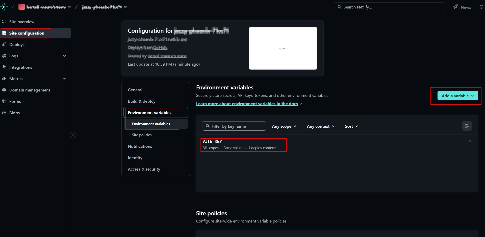

# Netlify Vite Environment variables integration

A `Vite` example about using Environment variables replaced during a `Netlify` build.

## Environment variables

Vite doesn't require any extra packages to make it working. A common package used to this goal is [dotenv](https://www.npmjs.com/package/dotenv), that expose the variables into `process.env`.
Vite exposes **only** the Environment variables starting with `VITE_` in the global variable `import.meta.env.`

## Setup

First, we need to creare a `.env` file in the app root.

```text
VITE_KEY=1234
```

*Remember that this file should not be committed in a git repo, as we don't want expose these secrets in `git history` and in a git `repository`.*

## Usage

Then, in a javascript file we can use the Environment variable `VITE_KEY`.

```javascript
const key = import.meta.env.VITE_KEY;
console.log(key);
```

## Local development

During development, for example via
> `npm run dev`

Vite doesn't replace any `import.meta.env.` variables, but instead expose the configured values at runtime.

This means that `import.meta.env.VITE_KEY` will be still visible in the code, but at runtime the value will be resolved to `1234`.

## Production environment

Instead, during production build via

> `npm run build`

or

> `npm run preview`

the **bundling** replaces all `import.meta.env.` with the values found.

This means that `import.meta.env.VITE_KEY` will be replaced directly in the source code with `1234` during bundling.

## Netlify integration

How then make it working while building and deploying with Netlify?

Netlify is able to expose to Vite the Environment variables.

Hence can Vite replace them **during the bundling** with the real values.

The configuration in Netlify is available in:
`Site configuration` > `Environment variables` > `Environment variables`.



## Working example

[A Vite App deployed with Netlify](https://jazzy-phoenix-71cc71.netlify.app/).

Take a look to the un-minified code, you will clearly see that `import.meta.env.VITE_KEY` has been replaced with the specified value.

